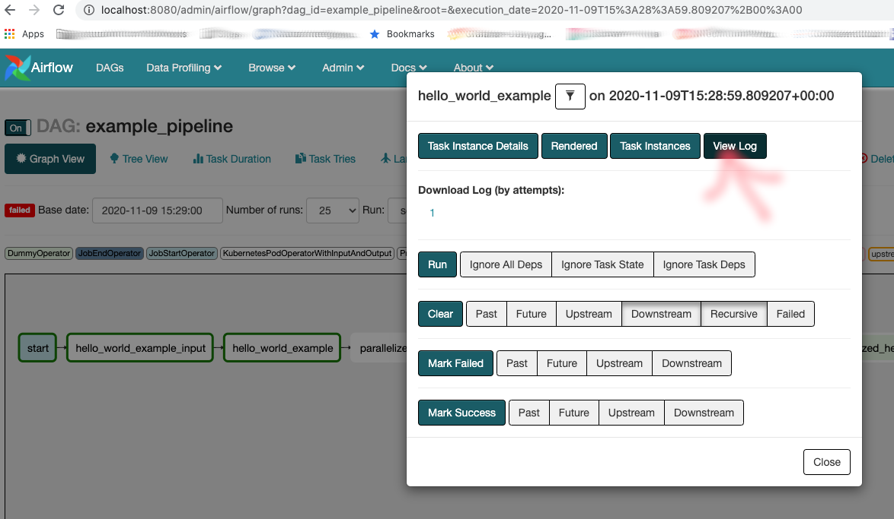

# Really Getting Started with Apache Liminal

Liminal is a MachineLearning orchestration platform, or in other words: Liminal enables data scientists and data engineers to define their entire ML system and flow using configuration. From feature engineering to production monitoring - and the framework takes care of the infra behind the scenes and seamlessly integrates with the infrastructure behind the scenes.


## Quick Start

So, you’ve heard about liminal and decided you want to give it a try.

This guide will allow you to set up your first apache Liminal environment and allow you to create some simple ML pipelines. These will be very similar to the ones you are going to build for real production scenarios. This is actually the magic behind Liminal.


## Prerequisites

Python 3 (3.6 and up)

[Docker Desktop](https://www.docker.com/products/docker-desktop)

*Note: make sure your kubernetes cluster is running*

### Apache Liminal Hello World

In this tutorial, we will go through setting up Liminal for the first time on your local dev machine.

I’m running this on my macBook, so this will cover mac related installation aspects and kinks (if there are any).

First, let’s build our examples project:

In the dev folder you work in create jsut clone the sample code from here:


```
git clone https://github.com/amihayz/liminal-examples
```

Create a python virtualenv to isolate your runs, like this:


```
cd liminal-examples
python3 -m venv env
```


And activate your virtual environment:


```
source env/bin/activate
```


Now we are ready to install liminal:


```
pip uninstall apache-liminal 
pip install apache-liminal
rm -rf ~/liminal_home
```
Let's build the images you need for the example:
```
Liminal build
```
The build will create docker container from the code we just created

```
liminal deploy --clean  # the --clean is for removing old containers from the previous install
```
The deploy will create missing containers and deploy them to your local kubernetes cluster

*Note: Liminal creates a bunch of assets, some are going to be located under: the directory in your LIMINAL_HOME env variable. But default LIMINAL_HOME is set to ~/liminal_home directory.*

Now lets runs it:
```
liminal start
```
Liminal now spins up AirFlow and configures the tasks defined in the Liminal.yml file
It includes these three containers: 
* liminal-postgress
* liminal-webserver
* liminal-scheduler

Once it finished loading the, 
Go to the airflow admin in the browser:


```
http://localhost:8080/admin/
```


***Important:** Click on the “On” button to activate the dag, nothing will happen otherwise!*

You can go to tree view to see all the tasks configured in the liminal.yml file: \
**<code>[http://localhost:8080/admin/airflow/tree?dag_id=example_pipeline](http://localhost:8080/admin/airflow/tree?dag_id=example_pipeline)</code></strong>

Now lets see what actually happened to our task:


Click on “hello_world_example” and you will get this popup: \


 \
Click on “view log” button and you can see the log of the current task run: \


Here are the entire list of commands to start from scratch:

```
git clone https://github.com/amihayz/liminal-examples
cd liminal-examples
python3 -m venv env
source env/bin/activate
pip uninstall apache-liminal
pip install apache-liminal
rm -rf ~/liminal_home
Liminal build
liminal deploy --clean
liminal start
```

### Closing up

Killing (cmd-c) the cmd you are running in would partially stop the containers in Docker desktop.
But, for making sure the dockers have closed:


```
docker container stop liminal-postgress
docker container stop liminal-webserver
docker container stop liminal-scheduler
```


To stop the python virtualenv just write:


```
deactivate
```
